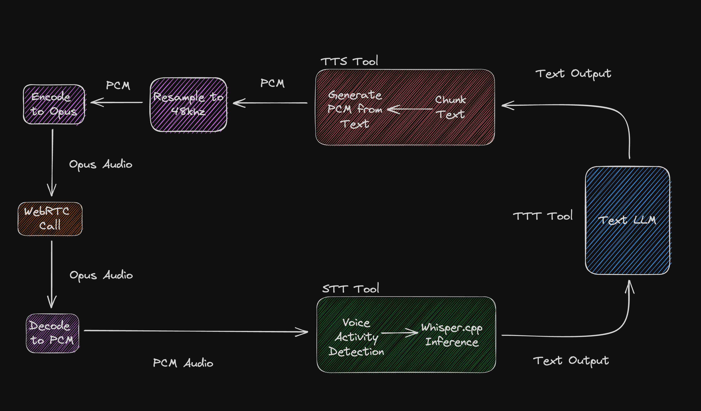

<h1 align="center">
  <br>
<a  href="https://github.com/GRVYDEV/S.A.T.U.R.D.A.Y">
    
</a>
  <br>
   Project S.A.T.U.R.D.A.Y 
  <br>
</h1>

<h4 align="center">A toolbox for vocal computing built with <a href="https://github.com/pion">Pion</a>, <a href="https://github.com/ggerganov/whisper.cpp">whisper.cpp</a>, and <a href="https://github.com/coqui-ai/TTS">Coqui TTS</a>. Build your own personal, self-hosted J.A.R.V.I.S powered by WebRTC</h4>

<p align="center">
    <a href="https://github.com/GRVYDEV/S.A.T.U.R.D.A.Y/stargazers"></a>
    <a href="https://github.com/GRVYDEV/S.A.T.U.R.D.A.Y/network/members"></a>
</p>

<p align="center">
  <a href="">View Demo</a> •
  <a href="#getting-started">Getting Started</a> •
  <a href="https://github.com/GRVYDEV/S.A.T.U.R.D.A.Y/issues">Request Features</a> •
</p>

<!-- TABLE OF CONTENTS -->
<details open="open">
  <summary><h2 style="display: inline-block">Table of Contents</h2></summary>
  <ol>
    <li>
      <a href="#about-the-project">About The Project</a>
      <ul>
        <li><ul>
          <li><a href="#how-it-works">How It Works</a></li>
          <li><a href="#diagram">Diagram</a></li>
        </ul></li>
        <li><a href="#built-with">Built With</a></li>
      </ul>
    </li>
    <li>
      <a href="#getting-started">Getting Started</a>
      <ul>
        <li><a href="#prerequisites">Prerequisites</a></li>
      </ul>
    </li>
    <li><a href="#roadmap">Roadmap</a></li>
    <li><a href="#discord">Discord</a></li>
    <li><a href="#bugs">Bugs</a></li>
    <li><a href="#contributing">Contributing</a></li>
    <li><a href="#license">License</a></li>
    <li><a href="#support-me">Support Me</a></li>
    <li><a href="#contact-me">Contact Me</a></li>
  </ol>
</details>

## About the Project

Project S.A.T.U.R.D.A.Y is a toolbox for vocal computing. It provides tools to build elegant vocal interfaces to modern LLMs. The goal of this project is to foster a community of like minded individuals who want to bring forth the technology we have been promised in sci-fi movies for decades. It aims to be highly modular and flexible while staying decoupled from specific AI Models. This allows for seamless upgrades when new AI technology is released.

### How It Works

Project S.A.T.U.R.D.A.Y is composed of tools. A tool is an abstraction that encapsulates a specific part of the vocal computing stack. There are 2 main constructs that comprise a tool:

- **Engine** - An engine encapsulates the domain specific functionality of a tool. This logic should remain the same regardless of the inference backend used. For example, in the case of the STT tool the engine contains the Voice Activity Detection algorithm along with some custom buffering logic. This allows the backend to be easily changed without needing to re-write code.

- **Backend** - A backend is what actually runs the AI inference. This is usually a thin wrapper but allows for more flexibility and ease of upgrade. A backend can also be written to interface with an HTTP server to allow for easy language inter-op.

This project contains 3 main kinds of tools. The 3 main tools are STT, TTT and TTS.

#### STT (Speech-to-Text)

STT tools are the ears of the system and perform Speech-to-Text inference on incoming audio.

#### TTT (Text-to-Text)

TTT tools are the brains of the system and perform Text-to-Text inference once the audio has been transformed into Text.

#### TTS (Text-to-Speech)

TTS tools are the mouth of the system and perform Text-to-Speech inference on the text proved by the TTT tool.

### Diagram

Here is a diagram of how the main demo currently works.



## Getting started

The demo that comes in this repo is your own personal, self-hosted J.A.R.V.I.S like assistant.

**DISCLAIMER**: I have only tested this on M1 Pro and Max processors. We are doing a lot of local inference so the demo requires quite a bit of processing power. Your mileage may very on different operating systems and hardware. If you run into problems please open an [issue](https://github.com/GRVYDEV/S.A.T.U.R.D.A.Y/issues).

In order to run the demo there are some pre-requisites.

### Prerequisites

In order to run the demo, [Golang](https://golang.org/doc/install), [Python](https://www.python.org/downloads/), [Make](https://www.gnu.org/software/make/) and a C Complier are required.

There are 3 processes that need to be running for the demo:

- **RTC** - The RTC server hosts the web page and a WebRTC server. The WebRTC server is what you connect to when you load the page and it is also what the client connects to to start listening to your audio.
- **Client** - The Client is where all of the magic happens. When it is started it joins the RTC server and starts listening to your audio. When you start speaking it will buffer the incoming audio until you stop. Once you stop speaking it will run STT inference on that audio, pass it to the TTT tool to generate a response to your text and then pass that output to the TTS tool to turn that response into speech. There are 2 system libraries needed to use the client `pkg-config` and `opus`. On macOS these can be installed with brew:

```shell
brew install opus pkg-config
```

- **TTS** - The TTS server is where text from the TTT tool is tranformed into speech. In the demo this uses [Coqui TTS](https://github.com/coqui-ai/TTS). There are 2 system libraries that are needed for this tool `mecab` and `espeak`. On macOS they can be installed with brew:

```shell
brew install mecab espeak
```

**NOTE**: For now the order in which you start the processes matters. You **MUST** start the RTC server and the TTS server **BEFORE** you start the client.

### 1. RTC

From the root of the project run `make rtc`

```shell
make run
```

### 2. TTS

**FIRST TIME SETUP**: When you run the tts server for the first time you will need to install the dependencies. Consider using a [virtual environment](https://docs.python.org/3/library/venv.html) for this.

```shell
cd tts/servers/coqui-tts
pip install -r requirements.txt
```

From the root of the project run `make tts`

### 3. Client

The client requires `whisper.cpp` and the use of `cgo` however the make script should take care of this for you.

From the root of the project run `make client`

```shell
make client
```

## Roadmap

### Local Inference

The main thing on the roadmap right now is getting TTT inference to run locally with something like [llama.cpp](https://github.com/ggerganov/llama.cpp). At the time of publishing this I do not have great internet and cannot download the model weights needed to get this working.

### Ease of Use

The second largest item on my roadmap is continuing to improve the setup and configuration process.

### Building With S.A.T.U.R.D.A.Y

The final thing on my roadmap is to continue to build applications with S.A.T.U.R.D.A.Y. I hope more people will build along with me as this is the #1 way to improve the project and uncover new features that need to be added.

## Discord

Join the [Discord](https://discord.gg/ndGZc3mA26) to stay up to date!

## Built With

This project is built with the following open source packages:

- [Pion](https://github.com/pion)
- [whisper.cpp](https://github.com/ggerganov/whisper.cpp)
- [Coqui TTS](https://github.com/coqui-ai/TTS)

## Bugs

I am very from perfect and there are bound to be bugs and things I've overlooked in the installation process.
Please, add issues and feel free to reach out if anything is unclear. Also, we have a Discord.

## Contributing

Contributions are what make the open source community such an amazing place to be learn, inspire, and create.
Any contributions you make are **greatly appreciated**.

1. Fork the Project
2. Create your Feature Branch: `git checkout -b feature/AmazingFeature`
3. Commit your Changes: `git commit -m 'Add some AmazingFeature'`
4. Push to the Branch: `git push origin feature/AmazingFeature`
5. Open a Pull Request

## License

MIT

## Support Me

If you like the project and want to financially support it feel free to [buy me a coffee](https://www.buymeacoffee.com/grvy)

## Contact Me

> GitHub [@GRVYDEV](https://github.com/GRVYDEV) &nbsp;&middot;&nbsp;
> Twitter [@grvydev](https://twitter.com/grvydev) &nbsp;&middot;&nbsp;
> Email grvy@aer.industries
